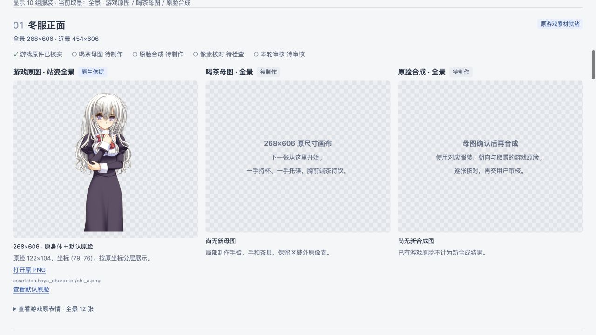

# 2026-09-30 千早旧美术清理

按用户要求清理旧图、整理 HTML，并保留 `assets/` 全部文件。当前方案见[新制作计划](../plans/2026-09-30-native-tea-and-original-faces.md)，图片见[进度页面](chihaya-character-progress.html)。

## 已移出项目

旧 AI 母图、表情候选、局部帧、导出图集、预览、生成提示词、QA、旧计划与图片记录共 29,921 个文件，其中 PNG 20,494 张，合计 15.43 GiB。它们移至项目外临时备份；本次操作没有腾出磁盘空间。

临时回退位置：`/private/tmp/chihaya-old-art-backup-20260930-zmfaugqo`。完整原路径、移动目标、文件数及保护目录哈希见[清理清单](/private/tmp/chihaya-old-art-backup-20260930-zmfaugqo/cleanup-manifest.json)。备份位于系统临时目录，可在仍存在时按原路径移回；它不参与当前制作或 HTML 展示。

移出的范围为：

- `ArtSources/CharacterExpansion/` 下旧版本、候选及其元数据；新原图配对、进度与 HTML 模板保留。
- 临时 `output/` 中的旧美术批次、原预览、头顶修复交付副本和旧图片位置索引。应用现用头顶修复资源及原近景运行备份保留。
- 旧三姿态制作计划、原画及表情审核报告，以及只服务旧目录的归档／脸部证明脚本。

README 与有效索引已指向新计划；生成器改为直接读取游戏原件、持久原图配对与新进度。旧完整立绘逐表情制作技能已同步为固定母图上的游戏原脸合成。运行资源导入脚本改为要求显式提供审核预览目录，不再隐式读取已移走的路径。

## 保留与状态

`assets/` 的 374 个文件全部保留，清理前后 SHA-256 一致。应用资源的 342 个文件全部保留，清理前后 SHA-256 一致。现用 326 张运行 PNG 与原近景运行备份仍通过源资源校验。

当前不存在已安装的扩展资源包。Swift 应用源码、状态机、现有测试、构建与发布相关的其他工作未因本次清理变更。新美术范围尚未接入应用。

新喝茶母图为 0/20，原脸合成为 0/20，审核为 0/10，全部保持待制作／待审核。游戏站姿原图与原表情是来源展示，不能算作新结果。08–10 新服装的尺寸与头部／原脸绑定仍为暂定。

## 验证

- 清单重新生成成功：10 组服装，7 组游戏原件，162 个唯一 PNG 来源；不再引用旧图片或临时预览资源。
- 游戏 PNG 哈希、尺寸、原脸配对、坐标边界及所有页面来源链接已核对；页面 JavaScript 语法检查通过。
- `python3 scripts/verify_resources.py --source-only` 通过：14 个运行变体、504 个眼嘴组合和 326 张运行 PNG。
- 项目内技能经内置 `quick_validate.py` 格式校验通过，原版本保存在回退目录。校验使用系统 Ruby YAML 解析器适配缺失的 PyYAML；没有安装新依赖。
- 预览导入器的 `--help` 与已修复运行资源覆盖保护已验证。

浏览器已验证服装筛选、全景／近景切换、游戏原表情展开与原尺寸人物查看、背景切换和新服装待制作位。近景原脸按原坐标正确叠加，未出现失效图片；更新后的页面已打开。预览截图：

